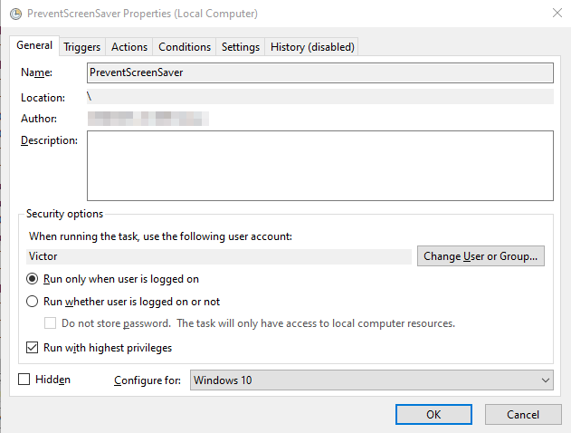
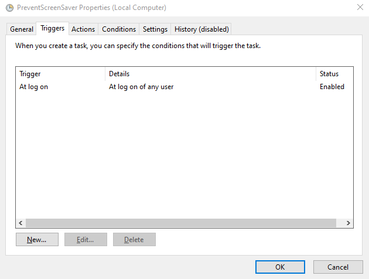
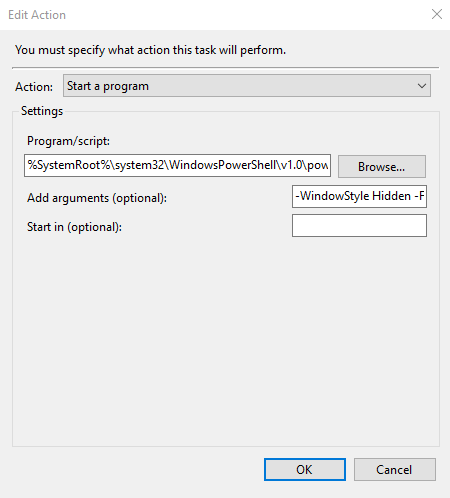

# prevent-screen-saver-windows

This project contains a script for keeping Windows awake and instructions on how to schedule this task to run automatically in the background.

## Why not simply use Windows power settings?

If your notebook is managed by a company or someone else, these settings might not be changeable. Even if they are, there can be settings in place that override that behaviour, causing the screen saver to pop up anyway. This is very annoying, because if that happens, you have to log in again by typing your password.

## How does it work?

The idea is to send a keypress every X amount of time so that Windows thinks there is always activity from the user. That way, the computer never turns off the screen or go into the screen saver.

Here, I've configured it to send the `F15` key (yes, that's an existing key for the software) which does absolutely nothing in practice, so it is unnoticeable and won't disrupt anything. As for the interval which this keypress is sent, I've set it to 60 seconds, which is a healthy amount of time. Moreover, trying to "optimize" this interval by setting a number closer to the actual interval until the pc turns off the screen after being idle would make almost no difference.

You can find the script at the root of this project: [`./prevent_screen_saver.ps1`](prevent_screen_saver.ps1).

## Running the script automatically

This script solves the issue, but it is rather inconvenient to run it every time you start your pc. Not only that, the Powershell screen would be visible which is not great. To solve both of this issues, we can set this script to run automatically using Windows Task Scheduler and with a flag that hides the Powershell window.

1) Open Task Scheduler and click on `Create Task`.

2) On the general tab:

3) On the Trigger tab:

❗ Notice that the trigger is `At log on`. Trying to set `At startup` doesn't work generally.

4) On the Actions tab, click on `New`, and add the following information:

- Program/script: `%SystemRoot%\system32\WindowsPowerShell\v1.0\powershell.exe`
- Add arguments: `-WindowStyle Hidden -File "{{full_path_to_script}}"`

❗ Be sure to insert the full path to the file including the filename with extension in {{full_path_to_script}} (without the double braces). For example: `-WindowStyle Hidden -File "C:\Users\Victor\Scripts\prevent_screen_saver.ps1"`.

❗ You can also provide simply `powershell` to `Program/script` if the binary is in your PATH. If for some reason an error occurs with the regular method, try this.

💡 Note the `-WindowStyle Hidden` flag, this is what makes the Powershell window be invisible.

5) Click OK to save.

The next time you log on to your user, the script should run automatically in the background, and keep running until you power your PC off.

## Check if the script is running

Open the Task Manager and go into the `Details` tab. There, you should find a Powershell process running.

There will probably more than one Powershell task running, so to find the correct one, add the `Command line` column by right clicking the header and choosing `Select columns`. Then, you should see something like `C:Windows\System32\WindowsPowerShell\v1.0\powershell.exe -WindowStyle Hidden -File "{{full_path_to_script}}"`. That is our process.

You can also go into the Task Scheduler and check the `Status` column. If it's not `Running`, the `Last Run Result` column should give you insight as to why. Remember to press `F5` to refresh the page.

## Terminating the script

If you want to terminate the script for some reason, first find the process following the [Check if the script is running](#check-if-the-script-is-running) section. Then, simply right click it and then select `End task`.

If you don't want this script running automatically anymore, just disable or remove the task in the Task Scheduler.
